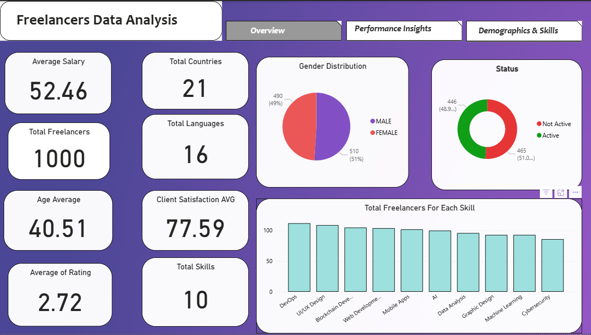
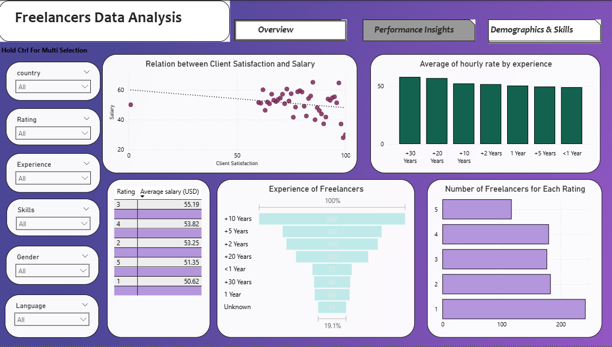
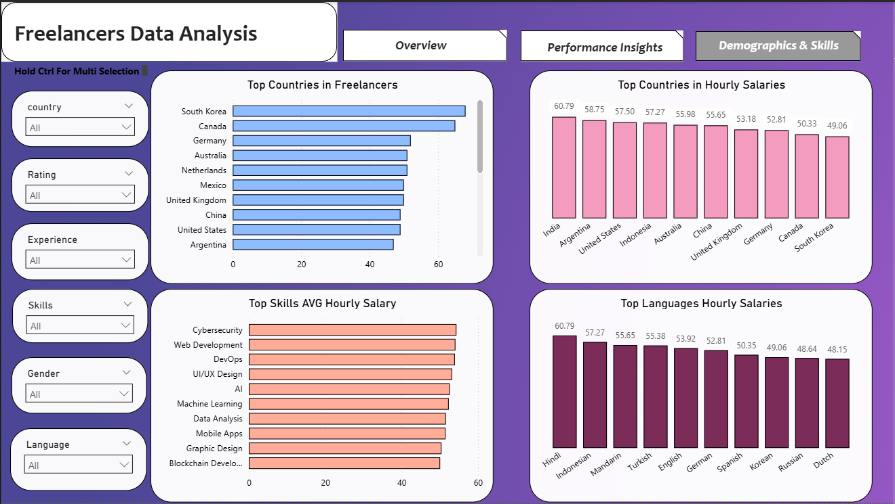

# 🌍 Global Freelancers Analytics Dashboard

## 🎯 Project Overview
Comprehensive analysis of global freelancer data to identify market trends, payment patterns, and performance insights across different demographics, skills, and experience levels.

**Tools Used:** Power BI, Power Query, Data Visualization, DAX, Business Intelligence

## 🔍 Data Analytics Project — Global Freelancers Dashboard

### 🎯 Objective
Analyze global freelancer data to identify:
- The best-paying freelancing fields
- Worker performance patterns
- Gender, country, and language insights
- Relationships between experience, payment, and client satisfaction

### 🧹 Data Cleaning & Preparation

#### 📁 Dataset Columns
ID, Name, Gender, Age, Country, Language, Skill, Years of Experience, Hourly Salary, Rating, Is Active, Client Satisfaction

#### 🧽 Cleaning Steps

**Gender Standardization:**
- Standardized inconsistent values (male, female, m, f, MALE, F, M, FEMALE)
- Used Replace Values to unify to "Male" and "Female"

**Hourly Salary Processing:**
- Used Trim to remove extra spaces
- Removed "USD" and "$" symbols (all salaries are in USD)

**Rating Enhancement:**
- Added a new custom column to round ratings into integers (1, 2, 3, 4, 5)

**Activity Status Standardization:**
- Standardized values (0,1,n,y,false,true,yes,no) into "Active" and "Not Active"

**Experience Grouping:**
- Created a new custom column to group years of experience using conditional statements:
  - Less than one year
  - One year
  - More than two years
  - More than five years
  - More than ten years
  - More than twenty years
  - More than thirty years

#### ⚠️ Handling Missing Data
- Some columns contained missing values (nulls)
- Critical nulls (e.g., missing salary, experience, or skill) were excluded from analyses where those fields were required
- Non-critical nulls (e.g., language or client satisfaction) were kept as null and handled via Power BI's filters or shown as "Blank" categories
- No arbitrary replacements were made to maintain data integrity

### 📈 Analysis Questions Addressed

#### 💰 Payment & Compensation
1. What is the average hourly salary?
2. Which freelancing job pays the most?
3. Is there a correlation between experience and payment?
4. Do higher-paid freelancers have better ratings and client satisfaction?

#### 📊 Market Overview
5. How many freelancers are in the dataset (KPI)?
6. What is the most common language offered?
7. Is there a relationship between language and payment?

#### 👥 Demographics & Performance
8. KPIs: Average age, average rating, and average client satisfaction
9. What is the gender distribution among freelancers?
10. Which countries have the most freelancers?
11. Which job has the most freelancers?
12. Top 5 countries by average hourly rate

### 🧭 Dashboard Design

#### 📂 Pages
1. **Overview** - High-level metrics and global distribution
 
2. **Performance Insights** - Ratings, experience, and client satisfaction

3. **Demographics & Salary** - Gender, country, and payment analysis

#### 📊 Visuals Used
- **Bar Charts** - Skill distribution and country analysis
- **Column Charts** - Salary comparisons and experience levels
- **Pie & Donut Charts** - Gender distribution and active status
- **Funnel Charts** - Experience progression
- **Scatter Plots** - Correlation analysis
- **Table Visuals** - Detailed data views

#### ⚙️ Features
- **Slicers** for dynamic filtering by skill, country, experience
- **Navigation buttons** for seamless page control
- **KPI cards** for key metrics visibility
- **Interactive tooltips** for detailed information

### 🔍 Key Insights Discovered

#### 👥 Gender & Activity Analysis
- **Male and female freelancers are nearly equal** in number across the platform
- **Active freelancers and males** tend to have slightly higher average salaries
- No significant gender bias in overall performance metrics

#### 💻 Freelancing Fields & Skills
- **DevOps has the most freelancers**, followed by UI/UX and Blockchain Development
- **Cybersecurity is the highest-paying skill**, followed by Web Development and DevOps
- High demand for technical skills correlates with premium pricing

#### 📈 Experience & Payment Trends
- **Salary generally increases with experience**, showing clear career progression
- **Plateau effect observed** at the 5+ year range where salary growth slows
- Experience beyond 2+ years shows diminishing returns on salary increases

#### ⭐ Rating & Client Satisfaction
- **3-star freelancers earn the highest average salary**, challenging conventional wisdom
- Both 1-star and 5-star rated freelancers have lower average pay
- **Higher client satisfaction correlates with slightly lower salary**, suggesting possible price sensitivity

#### 🌍 Geographical Insights
- **South Korea and Canada** have the highest concentration of freelancers
- **India, Argentina, and the US** lead in highest average hourly rates
- Emerging markets showing competitive pricing strategies

#### 🗣️ Language & Market Niches
- **Hindi, Indonesian, and Mandalorian** (fictional dataset value) are linked with the highest pay rates
- Language specialization can create premium market niches
- Multilingual freelancers command pricing advantages in specific regions

### 💡 Strategic Recommendations

#### For Recruiters & Clients:
- **Prioritize freelancers based on rating and performance**, not salary alone
- **Gender should not influence selection** — both perform equally well in the marketplace
- **Experience beyond 2+ years shows minimal salary difference** — focus on specific skills and portfolio
- Consider mid-range rated freelancers (3-star) for optimal value

#### For Freelancers:
- **Cybersecurity offers the best pay potential** in the current market
- **Learning Hindi, Indonesian, or niche languages** can provide competitive advantages
- Focus on building a strong portfolio rather than just accumulating years of experience
- Consider specializing in high-demand technical fields for premium pricing

### 🛠️ Technical Skills Demonstrated

#### Power BI & Data Processing:
- **Advanced Power Query** transformations and data cleaning
- **DAX calculations** for custom metrics and KPIs
- **Data modeling** with multiple related tables
- **Interactive dashboard design** with user-friendly navigation

#### Analytical Capabilities:
- **Correlation analysis** between multiple variables
- **Market segmentation** by skill, geography, and demographics
- **Trend identification** across experience levels and ratings
- **Data-driven recommendations** for both supply and demand sides

---

## 📞 Contact
For questions or collaboration opportunities, feel free to connect with me on [LinkedIn](https://www.linkedin.com/in/youssef-gebreal-297a43338/)
